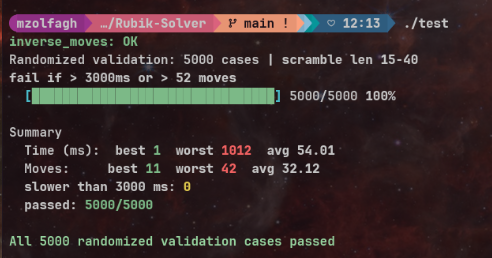

# Rubik Solver

Rubik Solver is a C++ command-line solver with a Python desktop visualizer built with pygame.

The repository includes:

- A C++ binary named `rubik` that parses a scramble and prints a solution sequence.
- A Python visualizer (`visualizer/`) that renders the cube in 3D, runs the solver, and animates moves.

**Credits:** 
- [Mohamad Zolfaghari Pour](https://github.com/zolfagharipour) — solver algorithm and C++ core.
- [Vitalii Frants](https://github.com/LuckyIntegral) — visualizer, tooling, input checking.

---

## Warning for 42 Students

This repository is intended as a reference and educational tool. **42 students are strongly advised not to copy this code without fully understanding its functionality.** Plagiarism in any form is against 42's principles and could lead to serious academic consequences. Use this repository responsibly to learn and better understand how to implement similar functionalities on your own.


## Algorithm: Thistlethwaite

The solver implements **Thistlethwaite’s algorithm**: the cube is solved in **four nested groups** G0 ⊃ G1 ⊃ G2 ⊃ G3 ⊃ G4, where **G4** is the solved state. Each step only uses moves that keep the cube inside the next smaller group.

| Phase | Group step | Goal (informal) | Allowed moves (this codebase) |
|-------|------------|-----------------|-------------------------------|
| 0 | G0 → G1 | **Edge orientation** fixed: every edge is “good” for half-turn–only solving later. | All face turns: `U`, `D`, `L`, `R`, `F`, `B` and their `'` / `2` |
| 1 | G1 → G2 | **Corner orientation** zero; **UD-slice edges** (E-slice) in the correct slice vs solved. | Same as phase 0 but **no** quarter `F`/`B` (only `F2`, `B2` on those faces) |
| 2 | G2 → G3 | **Corners** in the correct **tetrads**; **edges** in the **UD–FB / UD–RL** groups; parities and pattern checks for phase 3. | **Double turns only** on `R`, `L`, `F`, `B`; full `U`/`D` layer |
| 3 | G3 → G4 | **Fully solved** cube. | **Half turns only**: `U2`, `D2`, `L2`, `R2`, `F2`, `B2` |

After applying the scramble, the program runs **four successive searches**. Each search finds a short sequence that reaches the next subgroup; those moves are appended to the full solution.

### Search: IDA\* with pruning

Within each phase, the solver uses **IDA\*** (iterative deepening A\*):

- Depth limit starts at the **heuristic** value (see below) and increases when needed.
- A depth-first search explores sequences of **allowed moves** for that phase, with simple **move pruning** (no immediate repeat of the same face; canonical order on opposite faces).
- A node is cut off if `depth + h(state) > limit`, where `h` is admissible distance-to-goal information from the tables.

**Phase 4** additionally uses a **transposition table** keyed by encoded cube features and remaining depth, to avoid redundant work during an iteration.

### Heuristics (pattern databases)

Heuristics are **precomputed BFS distances** from the solved state, stored in **prune tables** (see `init_*_prune()` in `srcs/prune.cpp` and `heuristic_phase_*` in `srcs/heuristics.cpp`). At startup the solver fills **eight** tables; each entry is the minimum number of moves (in the relevant move set) needed to fix a **coarse feature** of the cube.

| Phase (0–3) | Heuristic (see `heuristic_phase_*` in `srcs/heuristics.cpp`) | What it measures |
|-------------|------------------------------------------------------------------|------------------|
| **0** | `_eo_prune[encodeEO(cube)]` | Distance to **edge orientation** solved (G1), using phase-0 moves in BFS. |
| **1** | `max(_co_prune[CO], _uds_prune[UDSlice])` | **Corner orientation** and **UD-slice / E-slice** pattern; both must reach 0 for G2. BFS uses phase-1 moves. |
| **2** | `max(_phase3_cp_prune[corner_composite], _phase3_ep_prune[edge_composite])` | **Corner** reduced position + tetrad permutations vs **edge** reduced position + UD-FB / UD-RL permutations toward G3. BFS uses phase-2 moves. |
| **3** | `max(_cp_prune[CP], _ep8_prune[EP8], _ep4_prune[EP4])` | **Full corner perm**, **8 edge** and **4 edge** encodings toward solved; all three must align. BFS uses phase-3 (half-turn) moves. |

If a sub-entry is missing (`-1`), the code uses a safe fallback (e.g. `0` or a large bound) so search does not misbehave on rare states.

Together, these tables give a **lower bound** on how many moves remain in the current phase, which makes IDA\* much faster than blind depth-first search.

## Prerequisites

- C++ compiler with Make support (`g++`, `make`)
- Python 3.9+ (for the visualizer)

## Build The C++ Solver

From project root:

```bash
make
```

This creates the executable:

```bash
./rubik
```

## C++ Solver Usage

Default: print the solution as one move per line:

```bash
./rubik "R U R' U'"
```

Human-readable report (phases, timings, colors):

```bash
./rubik --human "R U R' U'"
./rubik -h "R U R' U'"
```

Performance-oriented report (`performance_solution()`):

```bash
./rubik --performance "R U R' U'"
./rubik -p "R U R' U'"
```

Notes:

- With flags, the scramble string is the **last** argument.
- Moves must be space-separated and use standard notation (`R`, `U'`, `F2`, …).


## Tester (randomized validation)



Builds `test` from `main_test.cpp` and runs it.

The program:

1. Checks `inverse_move` (apply + inverse restores the cube) on random states.
2. Runs **500** random scrambles (length **15–40** moves).
3. For each solve, checks solution length (≤ **52** moves) and time (≤ **3000** ms).
4. Prints a progress bar and a summary (best/worst/avg time and move count).


```bash
make test
./test
```


## performance output sample

Builds `test_performance` from `main_test_performance.cpp`. It generates one random scramble (**20–40** moves), solves it, and prints **`performance_solution()`**

```bash
make test_performance
./test_performance
```


## Visualizer


```bash
make v
```

This will:

1. Create `venv/` with `python3 -m venv` if it does not exist.
2. Run `pip install -r requirements.txt` when `requirements.txt` changes (tracked via `venv/.deps_installed`).
3. Run `venv/bin/python3 visualizer/main.py`.

To remove the virtual environment completely:

```bash
make clean-venv
```

## Visualizer Usage

Main workflow:

1. Enter scramble moves in the scramble input.
2. Optionally set scramble length and click `Generate scramble`.
3. Click `Run ./rubik` to call the C++ solver.
4. Use `Load sequence`, `Play`, `Step`, `Back`, `Scramble only`, and `Solve only` for playback.

Controls:

- Mouse drag on canvas: rotate camera
- Mouse wheel: zoom
- `SPACE`: play/pause
- `LEFT` / `RIGHT`: step back/forward
- `R`: reset cube
- `V`: reset camera
- `ESC`: quit
